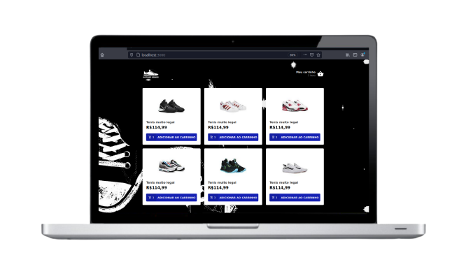

<h1 align="center">
    
    <br>Projeto Dstore shoes<br/>
    ReactJS | Redux | Redux-saga | styled-components
</h1>
<p align="center">
  <a aria-label="Versão do React" href="https://github.com/facebook/react/blob/master/CHANGELOG.md#16131-march-19-2020">
    </img>
  </a>
  <a aria-label="Versão do Redux" href="https://redux.js.org/">
    </img>
  </a>
    <a aria-label="Versão do Reactotron" href="https://github.com/infinitered/reactotron">
    </img>
  </a>
  <a aria-label="Versão do Styled-components" href="https://styled-components.com/">
    </img>
  </a>

 
</p>


## 💻 Projeto

**Dstore shoes** é um aplicação Web que consiste em uma loja online de vendas de tênis, suas funcionalidades estão distribuidas em:

- Lista os produtos na pagina inicial
- Lista os produtos adicionados no carrinho
- Remover produtos do carrinho
- Adiciona produtos no carrinho
- Alterar a quantidade de produtos no carrinho
- Calcula o subtotal dos produtos no carrinho
- Calcula o total dos produtos no carrinho

<h1 align="center">
    
</h1>

## Tecnologias

-  [ReactJS](https://reactjs.org/)
-  [Redux](https://redux.js.org/)
-  [Redux-saga](https://redux-saga.js.org/)
-  [Styled-components](https://styled-components.com/)
-  [Json-server](https://github.com/typicode/json-server)
-  [Axios](https://github.com/axios/axios)
-  [immer](https://github.com/immerjs/immer)
-  [React-toastify](https://fkhadra.github.io/react-toastify/introduction)
-  [Reactotron](https://github.com/infinitered/reactotron)
-  [React-icons](https://react-icons.github.io/react-icons/)

## Como Executar

- ### **Pré-requisitos**

  - É **necessário** possuir o **[Node.js](https://nodejs.org/en/)** instalado no computador
  - É **necessário** possuir o **[Git](https://git-scm.com/)** instalado e configurado no computador
  - Também, é **preciso** ter um gerenciador de pacotes seja o **[NPM](https://www.npmjs.com/)** ou **[Yarn](https://yarnpkg.com/)**.


1. Faça um clone do repositório:

```sh
  $ git clone https://github.com/Djaysson/Dstore_shoes.git
```

2. Executando a Aplicação:

```sh
  # Aplicação web
  $ cd Dstore_shoes
  # Instalando as dependências do projeto.
  $ yarn install # ou npm install
  # Inicie a aplicação web
  $ yarn start # ou npm start

  # Inicie a API Json-server na porta 3333
  $ npx json-server --watch -p 3333 server.json

```


