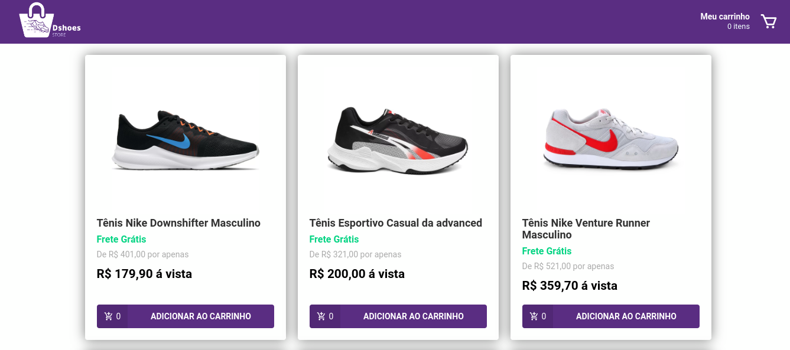

<h1 align="center">
    
<br/>
    ReactJS | Redux | Redux-saga | styled-components
</h1>
<p align="center">
  <a aria-label="Versão do React" href="https://github.com/facebook/react/blob/master/CHANGELOG.md#16131-march-19-2020">
    </img>
  </a>
  <a aria-label="Versão do Redux" href="https://redux.js.org/">
    </img>
  </a>
    <a aria-label="Versão do Reactotron" href="https://github.com/infinitered/reactotron">
    </img>
  </a>
  <a aria-label="Versão do Styled-components" href="https://styled-components.com/">
    </img>
  </a>

</p>

## 💻 Projeto

The **Dshoes store** is a web application made with ReactJS that consists of an online store selling sneakers.

<h1 align="center">
    
</h1>

## 🚀 Tecnologias

- [ReactJS](https://reactjs.org/)
- [Redux](https://redux.js.org/)
- [Redux-saga](https://redux-saga.js.org/)
- [Styled-components](https://styled-components.com/)
- [Json-server](https://github.com/typicode/json-server)
- [Axios](https://github.com/axios/axios)
- [immer](https://github.com/immerjs/immer)
- [React-toastify](https://fkhadra.github.io/react-toastify/introduction)
- [Reactotron](https://github.com/infinitered/reactotron)
- [React-icons](https://react-icons.github.io/react-icons/)

## ℹ️ How to Execute

- ### **Preconditions**

  - You must have **[Node.js](https://nodejs.org/en/)** installed on your computer.
  - You must have **[Git](https://git-scm.com/)** installed and configured on your computer.
  - Also, you need to have a package manager, either **[NPM](https://www.npmjs.com/)** or **[Yarn](https://yarnpkg.com/)**..

1. Make a clone of the repository:

```sh
  $ git clone https://github.com/Djaysson/dshoes-store.git
```

2. Application Execution:

```sh
  # Go to the project folder.
  $ cd dstore-shoes

  # Installing the project dependencies.
  $ yarn install # or npm install

  # Run the app
  $ yarn start # or npm start
```

Made by Djayson Rodrigues 👋 [Linkedin](https://www.linkedin.com/in/djaysonrodrigues/)
